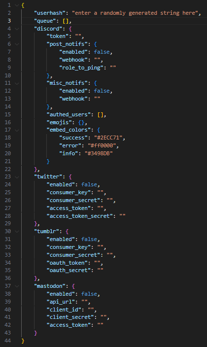
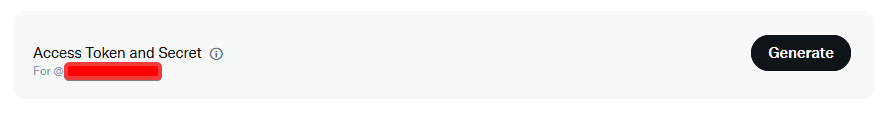

# Tweet Bot

This repository serves as the source code for the bot used to post on [@gifkitties](https://twitter.com/gifkitties).

## Features

- Post media directly from within Discord
    - The sites that are currently supported by the bot, and are able to be posted to, are as follows:
        - Twitter
        - Tumblr
        - Mastodon
    - The sites which the bot supports and is able to retrieve media from is as follows:
        - Tenor
        - Giphy
        - Any other site that has a URL ending in `.gif`
            - Params (such as authentication) aren't an issue, as the bot strips the parameters to check if the URL is supported, then continues the request as usual.
- Alert users when media has been posted
    - Depending on if you enable it within the configuration file, the bot will send a message alerting the end user when media has been posted.
    - This is also supported for the individual who posted the media as well.
- View the queue of media that is to be posted
    - You are able to delete and edit items within the queue as you see fit as well.
- Manual authentication
    - By default, the bot owner is given permission to run all commands. However, they are also able to grant authentication to other users by running `/auth add`.

## Installation

```bash
git clone https://github.com/paintingofblue/tweet-bot
cd tweet-bot
pip install -r requirements.txt
python3 main.py
```

After running the bot for the first time, it will create a configuration file in the root directory. You will need to edit this file with your respective API keys in order for the bot to function properly.

## Configuration



The configuration file by default is written within the root directory, and is named `config.json`.

### Misc

- `userhash` - This bot uses [catbox.moe](https://catbox.moe) to upload images. To get your userhash, create an account, then navigate to [User Area > Manage Account](https://catbox.moe/user/manage.php). Your userhash will be displayed at the top of the page.
- `queue` - This is able to be ignored, as it is populated whenever commands are ran.

### Discord

- `token` - [The token for the Discord bot.](https://discord.com/developers/applications).
- `post_notifs`
    - `enabled` - Whether or not to send messages to a given channel whenever media has been posted
        - Please note that this is primarily used for the end-user, not for the individuals who are using the bot.
    - `webhook` - [Discord Webhook URL to send the message to](https://support.discord.com/hc/en-us/articles/228383668-Intro-to-Webhooks)
    - `role_to_ping` - The role to ping within the message
- `misc_notifs`
    - `enabled` - Whether or not to send a message when a notification needs to be sent to the bot's users.
        - This is primarily used for the individuals who are using the bot, not for the end user.
    - `webhook` - [Discord Webhook URL to send the message to](https://support.discord.com/hc/en-us/articles/228383668-Intro-to-Webhooks).
- `emojis` - This is able to be ignored, as it is populated whenever commands are ran.
- `embed_colors` - This controls the colors of the Discord embeds. By default, they are set to what each respective term means, however, the option is there to change it.

### Twitter

If you do not have a Twitter API application, you are able to register one within the [Twitter Developer Portal](https://developer.twitter.com/en/portal/dashboard).

Please ensure before continuing that you have `User authentication` setup within your application. This can be found within the `User authentication settings` section.

Upon registering an application, you will need to generate a `Consumer key` and a `Consumer secret`, which is found in the `Keys and tokens` section of.


You will then need to generate an `Access Token` and an `Access Token Secret`, which is found in the `Authentication Tokens` section.



- `enabled` - Whether or not to enable Twitter support.
- `consumer_key` - The consumer key you were given when you generated your keys.
- `consumer_secret` - The consumer secret you were given when you generated your keys.
- `access_token` - The access token you were given when you generated your keys.
- `access_secret` - The access token secret you were given when you generated your keys.

### Tumblr

If you do not have a Tumblr API key, you are able to register an application [here](https://www.tumblr.com/oauth/apps).

Upon registering an application, you will be given a `Consumer key`, as well as a `Consumer secret`. You will need to generate an `OAuth token` and an `OAuth token secret` as well.

Both of these keys are able to be generated [here](https://api.tumblr.com/console/calls/user/info), which you will then need to add to the configuration file.

- `enabled` - Whether or not to enable Tumblr support.
- `consumer_key` - The consumer key you were given when you registered your application.
- `consumer_secret` - The consumer secret you were given when you registered your application.
- `oauth_token` - The OAuth token you were given when you generated your keys.
- `oauth_secret` - The OAuth token secret you were given when you generated your keys.

### Mastodon

If you do not have a Mastodon API key, you are able to sign up under [botsin.space](https://botsin.space), a Mastodon instance dedicated to bots.

After signing up, navigate to `Preferences > Development`, where then you are able to create an application.

Upon creating an application, you will be met with your respective API keys.

- `enabled` - Whether or not to enable Mastodon support.
- `client_key` - The client key you were given when you registered your application.
- `client_secret` - The client secret you were given when you registered your application.
- `access_token` - The access token you were given when you generated your keys.
- `base_url` - The base URL of the Mastodon instance you are using.
    - For this bot, the default will be `https://botsin.space`, so this can be ignored.
